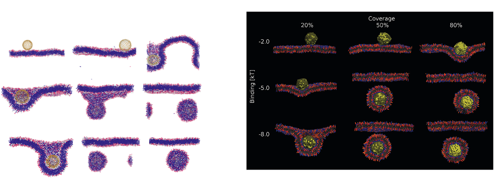

# Nano_Endo
Endocytosis of nanoparticles using the Cooke-Deserno potential.

## Step 1: Create a membrane

Run [membrane.py](membrane.py), and set the size of your membrane. The size is related to the box size of the system, and lipids are placed on an HCP lattice.
Larger membranes may need more time to equilibrate, or may be unstable. 

## Step 2: Equilibrate Membrane

Use the LAMMPS code provided, [equil.in](equil.in) to equilibrate the membrane. Again, larger membranes take longer to relax. If you do create your own membrane, please be sure to change the name in [starter.py](starter.py) and [lipid.in](lipid.in).

## Step 3: Put the system together

[starter.py](starter.py) will create a spherical nanoparticle with n ligands and ε interaction strength. It is currently set up to be run as a batch job, reproducing the results from the following paper: 
Vácha, R., Martinez-Veracoechea, F. J., &#38; Frenkel, D. (2011). Receptor-mediated endocytosis of nanoparticles of various shapes. <i>Nano Letters</i>, <i>11</i>(12), 5391–5395. https://doi.org/10.1021/nl2030213

These files can be created in batch and by running the [collect.sh](colelct.sh) file.

Feel free to create your own nanoparticles with various distributions of ligands on the surface.

## Step 4: Run in LAMMPS

The [lipid.in](lipid.in) file will run the membrane and particle in LAMMPS.

## Results:

## Caveat:

In the original simulations done by Vácha et al, a cutoff was put in place to reduce the computational time for the tail-tail potential. This cutoff is not implemented here, and as a result there is a tendency for endocytosed particles to stay next to the membrane. Videos of this can be seen in the images folder.

## Thanks:

Thank you to Robert Vácha & Lukáš Sukeník for your guidance.
tab_pot.py is adapted from *"Moltemplate: A Tool for Coarse-Grained Modeling of Complex Biological Matter and Soft Condensed Matter Physics", J. Mol. Biol., 2021, 433(11):166841, Jewett AI, Stelter D, Lambert J, Saladi SM, Roscioni OM; Ricci M, Autin L, Maritan M, Bashusqeh SM, Keyes T, Dame RT; Shea J-E, Jensen GJ, Goodsell DS*
[https://doi.org/10.1016/j.jmb.2021.166841](https://doi.org/10.1016/j.jmb.2021.166841)
